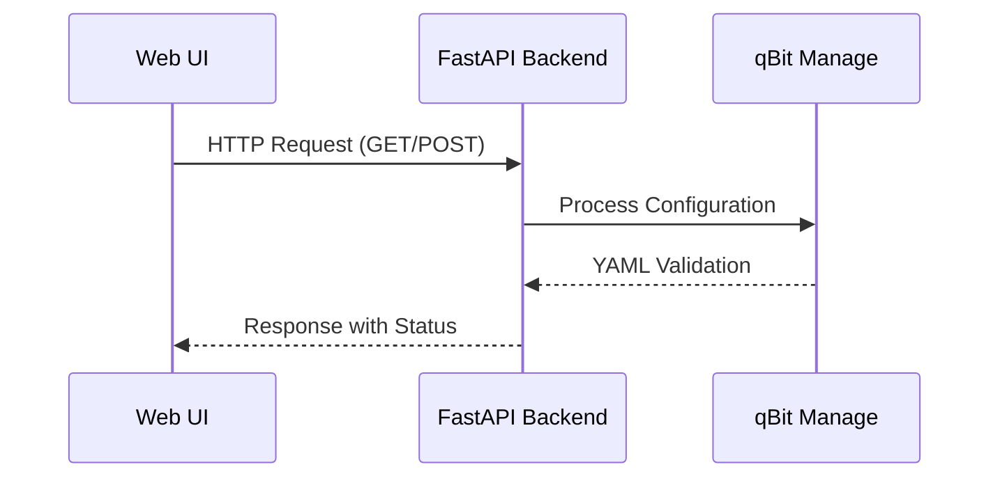

# qBit Manage Web UI

## Overview
The qBit Manage Web UI provides a modern interface for configuring and managing qBit Manage. It offers real-time editing of YAML configuration files through an intuitive visual interface, eliminating the need for manual file editing.

## Project Structure
```
web-ui/
├── css/               # Stylesheets
│   ├── components/    # Component-specific styles
│   ├── main.css       # Global styles
│   ├── responsive.css # Responsive layouts
│   └── themes.css     # Theme definitions
├── img/               # Application images and icons
├── js/                # Application logic
│   ├── api.js         # Backend communication
│   ├── app.js         # Main application
│   ├── components/    # UI components
│   ├── config-schemas/ # Configuration schemas
│   └── utils/         # Helper functions
└── index.html         # Application entry point
```

## Key Features
- **Visual Configuration Editor**: Intuitive forms for editing YAML configurations
- **Real-time Validation**: Instant feedback on configuration errors
- **Undo/Redo History**: Track and revert changes with history management
- **Theme Support**: Light/dark mode with system preference detection
- **Responsive Design**: Works on desktop and mobile devices
- **YAML Preview**: Real-time preview of generated configuration

## Configuration Sections
The UI organizes configuration into logical sections:
1. **Commands**: Manage script execution workflows
2. **qBittorrent Connection**: Configure qBittorrent API access
3. **Settings**: Application preferences and behavior
4. **Directory Paths**: Define important filesystem locations
5. **Categories**: Torrent category management
6. **Category Changes**: Bulk category modification rules
7. **Tracker Configuration**: Per-tracker settings
8. **No Hard Links**: Category-specific hardlink handling
9. **Share Limits**: Ratio and seeding time rules
10. **Recycle Bin**: Deleted torrent management
11. **Orphaned Files**: Cleanup of unregistered files
12. **Notifications**: Alert configuration
13. **Logs**: View application logs

## Technical Architecture

### Frontend Components
- **ConfigForm.js**: Dynamic form generator based on JSON schemas
- **CommandPanel.js**: Interface for executing management commands
- **LogViewer.js**: Real-time log display component
- **HistoryManager.js**: Undo/Redo functionality implementation

### API Integration
The UI communicates with the backend through a RESTful API:



Key API endpoints:
- `GET /api/configs`: List available configurations
- `PUT /api/configs/{filename}`: Update configuration file
- `POST /api/run-command`: Execute management commands
- `GET /api/logs`: Stream application logs

Error handling includes:
- JWT authentication
- Automatic retry on network failures
- Websocket support for real-time updates

## Usage Notes
1. Ensure the qBit Manage backend is running
2. Open `index.html` in a modern browser
3. Select a configuration file from the dropdown
4. Navigate sections using the sidebar
5. Use the preview button to see generated YAML
6. Save changes when complete

Keyboard Shortcuts:
- `Ctrl+S`: Save current configuration
- `Ctrl+R`: Toggle Run Commands modal
- `Ctrl+Z`: Undo last change
- `Ctrl+Y`: Redo last change
- `Ctrl+/`: Toggle Help modal
- `Ctrl+P` or `Cmd+P`: Toggle YAML preview
- `Escape`: Close modals/panels
